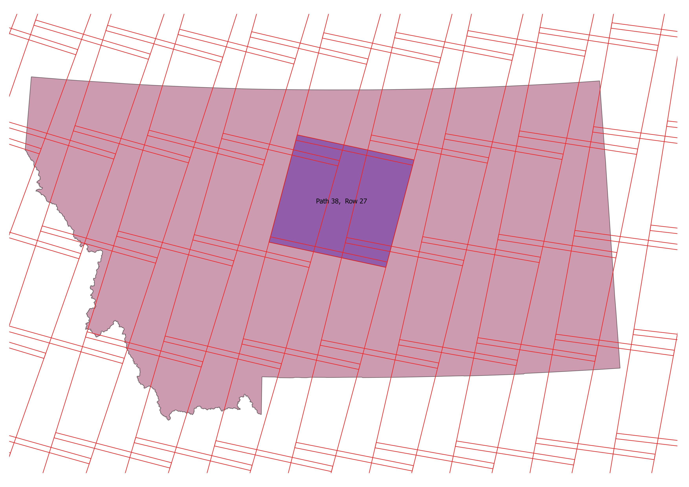

# 

[](https://travis-ci.org/dgketchum/Landsat578)
[](https://codecov.io/gh/dgketchum/Landsat578)
[](https://badge.fury.io/py/Landsat578)

# Easy Landsat Download

Download and unzip Landsat 5, 7, and 8 (a.k.a. LT5, LE7, LC8) images 
via the USGS website automatically using a command line interface or 
a simple python script.

## Install
To get the package from PyPi:
```
$ pip install Landsat578
```

To get the package with conda:
```
$ conda install Landsat578
```

Go to the USGS [Earth Observation site](https://ers.cr.usgs.gov/register/), and start an 
account.  Put your username and password seperated by one space in a .txt file
for use while downloading. Don't put spaces in your password itself.

Landsat instruments orbit the earth in sun-synchronous fashion.
They pass over each place at approximately the same 
time of day, every 16 days. The area within each image is
predefined and is described by (path,row) coordinates of
the World Reference System 2 (WRS2).
This system applies to all Landsat missions since LT4.
Every place on Earth falls under at lease one path/row 'scene.'
Some places fall within overlapping path/row scenes. Landsat 
'descends' from North to South in the day, these images are of
most interest to researchers, though nighttime images are also
available. You can get GIS data of WRS2 [here.](https://landsat.usgs.gov/pathrow-shapefiles)

See WRS2 over the US state of Montana. Scene 38, 27 is highlighted
in purple. Note overlap of neighboring scenes.

# 


# Run

If you know the path and row of a location, you can enter it in the 
command line interface to download and unzip images there between
your specified start and end dates.  You must choose a satellite.
Within the package you downloaded, you need to call landsat_download.py.
Dates are entered as YYYY-MM-DD format, e.g. 2008-05-31.

```
$ landsat_download.py LE7 2007-05-01 2007-05-31 --path 38 --row 27 -o /path/to/folder --credentials usgs.txt
```
This command will find the two images that were captured by Landsat
5 of scene 38, 27 in the month of May, 2007 and unzip them to your folder.
Use the optional parameter ```--return-list``` to just get a list
of what was found:


```
$ landsat_download.py LE7 2007-05-01 2007-05-31 --path 38 --row 27 --return-list
```

This will return the two image scene IDs and print to your screen.

```
['LE70360292007122EDC00', 'LE70360292007138EDC00']
```
These images happen to have been taken 2007-05-02 (Day of Year, DOY: 122),
and on 2007-05-18 (DOY 138). See NOAA's day of year [calendar.](https://www.esrl.noaa.gov/gmd/grad/neubrew/Calendar.jsp)

The naming conventions of Landsat images are as follows from
the USGS Landsat [site.](https://landsat.usgs.gov/what-are-naming-conventions-landsat-scene-identifiers)


# 

You can also download by WGS decimal degrees coordinates (i.e., latitude and longitude):
```
$ landsat_download.py LE7 2007-05-01 2007-05-31 --lat 46.5 --lon -107.5 --credentials usgs.txt
```
A negative number lat is in the southern hemisphere, a negtive lon is the 
western hemisphere.  

If you want a bulk download of many scenes, you can get the shapefile of WRS2
descending, select your scenes of interest, save the selection as a shapefile,
and pass the shapefile to the program. Learn to do this [here](https://www.youtube.com/watch?v=CJzq92IcpYg) on the free and
open source [QGIS](http://www.qgis.org/en/site/) (great software!).
```
$ landsat_download.py LE7 2007-05-01 2007-05-31 /path/to/selected_scenes.shp --credentials usgs.txt
```

# Use a Python Script

If you prefer to work from a python script, use sample_script.py:

```
import os
from datetime import datetime

from landsat import downloader


def get_landsat((start, end), satellite, (path, row), (lat, lon), shape, usgs_creds,
                dry_run):

    downloader.download_landsat((start, end), satellite, path_row_tuple=(path, row),
                                output_path=output, usgs_creds=usgs_creds, dry_run=False)

if __name__ == '__main__':
    home = os.path.expanduser('~')
    start = datetime(2007, 5, 1)
    end = datetime(2007, 5, 30)
    satellite = 'LT5'
    output = os.path.join(home, 'images',)
    usgs_creds = os.path.join(home, 'usgs.txt')
    path_row = 37, 27
```
This work was adapted in part from work from [DevelopmentSeed](https://github.com/olivierhagolle) and [Olivier Hagolle.](https://github.com/developmentseed)
# 2017 dgetchum

